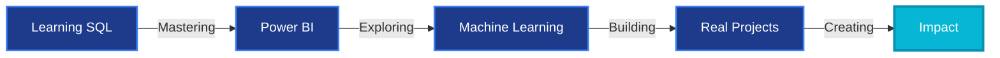

<div align="center">


</div>

<h1 align="center">
  
</h1>

<p align="center">
  
</p>

## 🌊 About Me


```js
const andre = {
  role: "FullStack Developer",
  location: "🌎",
  education: "Computer Science • 4th Year",
  passion: ["Clean Code", "UX/UI", "Innovation"],
  learning: ["SQL", "Power BI", "ML"],
  available: true
}
```

**🎯 Focus:** Creating digital experiences that matter  
**💡 Motto:** *Code with purpose, design with soul*

<br clear="right"/>

## 💠 Tech Stack

<div align="center">

|                                                                                                          |                                                                                                           |                                                                                                                 |
|:--------------------------------------------------------------------------------------------------------:|:---------------------------------------------------------------------------------------------------------:|:---------------------------------------------------------------------------------------------------------------:|
|        |      ||
|          |               |               |
|           ||            |
|        ||              |
||      |               |

</div>

## 🎨 Expertise

<table align="center">
<tr>
<td align="center" width="25%">

<br><strong>Web Dev</strong>
<br>Full-Stack Solutions
</td>
<td align="center" width="25%">

<br><strong>UX/UI</strong>
<br>User-Centered Design
</td>
<td align="center" width="25%">

<br><strong>3D Graphics</strong>
<br>WebGL & Three.js
</td>
<td align="center" width="25%">

<br><strong>Data Analytics</strong>
<br>Insights & Visualization
</td>
</tr>
</table>

## 🚀 Current Journey



<div align="center">

|📚 Learning      |🎯 Goals            |💭 Future           |
|:--------------:|:-----------------:|:-----------------:|
|SQL & Power BI  |Cloud Certification|AI/ML Integration  |
|Data Science    |Open Source        |System Architecture|
|Advanced Backend|Portfolio Launch   |Tech Leadership    |

</div>

## 🌐 Connect

<p align="center">
  <a href="https://github.com/TU_USUARIO">
    
  </a>
  <a href="https://linkedin.com/in/TU_USUARIO">
    
  </a>
  <a href="mailto:tu_email@example.com">
    
  </a>
  <a href="https://tu-portfolio.com">
    
  </a>
</p>

<p align="center">
  
</p>

-----

<div align="center">

### ⚡ *“Building the future, one line at a time”* ⚡


</div>

