<div align="center">


</div>

<h1 align="center">
  
</h1>

<br>

<p align="center">
  
</p>

<br>

## 🌊 Sobre Mí

<table>
<tr>
<td width="50%">


</td>
<td width="50%">

```javascript
const andre = {
  rol: "Desarrollador FullStack",
  ubicación: "🌎",
  educación: "Ciencias de la Computación • 4to Año",
  pasión: ["Código Limpio", "UX/UI", "Innovación"],
  aprendiendo: ["SQL", "Power BI", "Machine Learning"],
  disponible: true,
  mentalidad: "Innovación constante"
}
```

**🎯 Enfoque:** Crear experiencias digitales que importan  
**💡 Lema:** *Crea, diseña y programa con propósito*

</td>
</tr>
</table>

<br>

## 💠 Stack Tecnológico

<div align="center">

### 💻 Lenguajes de Programación


### 🌐 Desarrollo Web


### 🎨 Diseño & UX/UI


### 📊 Análisis de Datos


### 🛠️ Herramientas de Desarrollo


</div>

<br>

## 🎨 Áreas de Expertise

<table align="center">
<tr>
<td align="center" width="33%">

<br><br>
<strong>Desarrollo Web</strong>
<br><br>
<p>Soluciones FullStack robustas y escalables con las mejores prácticas</p>
</td>
<td align="center" width="33%">

<br><br>
<strong>Diseño UX/UI</strong>
<br><br>
<p>Interfaces intuitivas centradas en la experiencia del usuario</p>
</td>
<td align="center" width="33%">

<br><br>
<strong>Gráficos 3D</strong>
<br><br>
<p>Experiencias visuales inmersivas con WebGL y Three.js</p>
</td>
</tr>
</table>

<br>

## 🚀 Mi Trayectoria Actual

<div align="center">



</div>

<br>

<div align="center">

```mermaid
graph LR
    A[Aprendiendo SQL] -->|Dominando| B[Power BI]
    B -->|Explorando| C[Machine Learning]
    C -->|Construyendo| D[Proyectos Reales]
    D -->|Creando| E[Impacto]
    
    style A fill:#1e3a8a,stroke:#3b82f6,stroke-width:2px,color:#fff
    style B fill:#1e3a8a,stroke:#3b82f6,stroke-width:2px,color:#fff
    style C fill:#1e3a8a,stroke:#3b82f6,stroke-width:2px,color:#fff
    style D fill:#1e3a8a,stroke:#3b82f6,stroke-width:2px,color:#fff
    style E fill:#06b6d4,stroke:#0891b2,stroke-width:3px,color:#fff
```

|📚 Aprendiendo Ahora|🎯 Objetivos 2025   |💭 Visión Futura         |
|:-----------------:|:-----------------:|:----------------------:|
|SQL Avanzado       |Certificación Cloud|Integración IA/ML       |
|Power BI           |Open Source        |Arquitectura de Sistemas|
|Data Science       |Lanzar Portfolio   |Liderazgo Técnico       |

</div>

<br>

## 🌐 Conectemos

<p align="center">
  <a href="https://github.com/Abranr">
    
  </a>
  <a href="https://www.linkedin.com/in/abranr2204">
    
  </a>
  <a href="mailto:tu_email@example.com">
    
  </a>
  <a href="https://tu-portfolio.com">
    
  </a>
</p>

<br>

<p align="center">
  
</p>

<br>

-----

<div align="center">

### ⚡ *“Construyendo el futuro, una línea de código a la vez”* ⚡


</div>

<br>

