<div align="center">


<br>


<br>

<p style="font-family: serif;">
  <i>"Donde el código se encuentra con el arte"</i>
</p>

</div>

<br>

<div align="center">
  
</div>

<br>

## 〈 Perfil Profesional 〉

<table>
<tr>
<td width="60%">

Estudiante de **Ingeniería en Sistemas de Información** en su cuarto año, especializado en **Ciencias de la Computación**. Mi enfoque se centra en crear soluciones digitales que no solo cumplan con su función técnica, sino que también ofrezcan experiencias excepcionales a los usuarios.

Con una sólida formación en desarrollo **FullStack** y una marcada inclinación hacia el **diseño UX/UI**, busco constantemente el equilibrio perfecto entre funcionalidad y estética. Actualmente expandiendo mis conocimientos en **análisis de datos** con SQL y Power BI.

### ◇ Filosofía de Trabajo

> *“La excelencia no es un acto, sino un hábito. Cada línea de código es una oportunidad para crear algo extraordinario.”*

</td>
<td width="40%">

```javascript
const profile = {
  identity: {
    name: "Andre Bran",
    role: "FullStack Developer",
    passion: "UX/UI Design"
  },
  
  expertise: [
    "Web Development",
    "User Experience",
    "Data Analytics",
    "3D Graphics"
  ],
  
  current: {
    learning: "SQL & Power BI",
    building: "Innovative Solutions",
    exploring: "Machine Learning"
  },
  
  mindset: "Innovation + Elegance"
};
```

</td>
</tr>
</table>

<br>

## 〈 Arsenal Tecnológico 〉

<div align="center">

### ⟨ Lenguajes & Frameworks ⟩

<br>

<table>
<tr>
<td align="center" width="140">

<br><sub><b>Java</b></sub>
</td>
<td align="center" width="140">

<br><sub><b>C++</b></sub>
</td>
<td align="center" width="140">

<br><sub><b>Python</b></sub>
</td>
<td align="center" width="140">

<br><sub><b>JavaScript</b></sub>
</td>
<td align="center" width="140">

<br><sub><b>PHP</b></sub>
</td>
</tr>
</table>

<br>

### ⟨ Frontend & Design ⟩

<br>

<table>
<tr>
<td align="center" width="140">

<br><sub><b>HTML5</b></sub>
</td>
<td align="center" width="140">

<br><sub><b>CSS3</b></sub>
</td>
<td align="center" width="140">

<br><sub><b>Three.js</b></sub>
</td>
<td align="center" width="140">

<br><sub><b>Figma</b></sub>
</td>
<td align="center" width="140">

<br><sub><b>Adobe XD</b></sub>
</td>
</tr>
</table>

<br>

### ⟨ Data & Analytics ⟩

<br>

<table>
<tr>
<td align="center" width="140">

<br><sub><b>SQL</b></sub>
</td>
<td align="center" width="140">

<br><sub><b>Power BI</b></sub>
</td>
<td align="center" width="140">

<br><sub><b>Pandas</b></sub>
</td>
<td align="center" width="140">

<br><sub><b>NumPy</b></sub>
</td>
<td align="center" width="140">

<br><sub><b>Matplotlib</b></sub>
</td>
</tr>
</table>

<br>

### ⟨ Development Tools ⟩

<br>

<table>
<tr>
<td align="center" width="140">

<br><sub><b>GitHub</b></sub>
</td>
<td align="center" width="140">

<br><sub><b>Git</b></sub>
</td>
<td align="center" width="140">

<br><sub><b>VS Code</b></sub>
</td>
<td align="center" width="140">

<br><sub><b>IntelliJ IDEA</b></sub>
</td>
<td align="center" width="140">

<br><sub><b>Postman</b></sub>
</td>
</tr>
</table>

</div>

<br>

## 〈 Proceso Creativo 〉

<div align="center">


</div>

<br>

<table>
<tr>
<td width="25%" align="center">

### ✦ INVESTIGAR

Análisis profundo del problema y necesidades del usuario

-----

*Empatía*  
*Investigación*  
*Comprensión*

</td>
<td width="25%" align="center">

### ✦ CONCEPTUALIZAR

Ideación y diseño de soluciones innovadoras

-----

*Creatividad*  
*Wireframes*  
*Prototipos*

</td>
<td width="25%" align="center">

### ✦ DESARROLLAR

Implementación con código limpio y eficiente

-----

*Arquitectura*  
*Desarrollo*  
*Testing*

</td>
<td width="25%" align="center">

### ✦ EVOLUCIONAR

Mejora continua basada en feedback

-----

*Iteración*  
*Optimización*  
*Escalabilidad*

</td>
</tr>
</table>

<br>

## 〈 Áreas de Expertise 〉

```mermaid
mindmap
  root((Andre<br/>Bran))
    (Desarrollo<br/>Web)
      Frontend Moderno
      Backend Robusto
      APIs RESTful
      Arquitectura MVC
    (UX/UI<br/>Design)
      Research de Usuario
      Wireframing
      Prototyping
      Design Systems
    (Gráficos<br/>3D)
      Three.js
      WebGL
      OpenGL
      Animaciones
    (Data<br/>Analytics)
      SQL Avanzado
      Power BI
      Visualización
      Business Intelligence
```

<div align="center">



</div>

<br>

## 〈 Trayectoria de Crecimiento 〉

<div align="center">

<table>
<tr>
<td width="33%" align="center">

### 📚 Dominando Actualmente

◇ SQL Avanzado  
◇ Power BI  
◇ Data Visualization  
◇ Machine Learning Basics

</td>
<td width="33%" align="center">

### 🎯 Objetivos a Corto Plazo

◇ Certificación en Cloud  
◇ Contribuir a Open Source  
◇ Lanzar Proyecto Personal  
◇ Dominar Arquitectura de Software

</td>
<td width="33%" align="center">

### 💫 Visión Futura

◇ Inteligencia Artificial  
◇ Blockchain Technology  
◇ DevOps & CI/CD  
◇ System Design at Scale

</td>
</tr>
</table>

</div>

<br>

## 〈 Principios Fundamentales 〉

<div align="center">


<br><br>

|               |                                               |
|:-------------:|:---------------------------------------------:|
|**Excelencia** |Cada proyecto es una obra maestra en potencial |
|**Innovación** |Siempre buscando formas mejores y más elegantes|
|**Simplicidad**|La complejidad es enemiga de la elegancia      |
|**Impacto**    |El código debe mejorar la vida de las personas |
|**Crecimiento**|El aprendizaje es un viaje sin fin             |

<br>


> *“La perfección no se logra cuando no hay nada más que agregar,*  
> *sino cuando no hay nada más que quitar.”*  
> **— Antoine de Saint-Exupéry**

</div>

<br>

## 〈 Colaboración & Contacto 〉

<div align="center">

### ✦ Disponible para Proyectos Innovadores ✦

<br>

<table>
<tr>
<td align="center">

[](https://github.com/TU_USUARIO)

**Explora mis proyectos**

</td>
<td align="center">

[](https://linkedin.com/in/TU_USUARIO)

**Conectemos profesionalmente**

</td>
<td align="center">

[](mailto:tu_email@example.com)

**Conversemos sobre ideas**

</td>
<td align="center">

[](https://tu-portfolio.com)

**Descubre mi trabajo**

</td>
</tr>
</table>

<br>


</div>

<br>

-----

<div align="center">

*Diseñado con ♥ por Andre Bran*

**CREA • DISEÑA • INNOVA**

<br>


</div>