<div align="center">


</div>

<br>

<p align="center">
  
</p>

<div align="center">

[](https://git.io/typing-svg)

</div>

<br>

## 🌊 Sobre Mí

<table>
<tr>
<td width="50%">


</td>
<td width="50%">

```javascript
const Andre = {
  rol: "Desarrollador FullStack",
  educación: "Ingeniería en Sistemas de Información y Ciencias de la Computación • 4to Año",
  pasión: ["Código Limpio", "UX/UI", "Innovación"],
  aprendiendo: ["SQL", "Power BI", "Machine Learning"],
  disponible: true,
  mentalidad: "Innovación constante",
  
  getStatus() {
    return `🚀 ${this.mentalidad}`;
  },
  
  nextStep() {
    return "Construir el futuro digital";
  }
}

console.log(Andre.getStatus()); // 🚀 Innovación constante
```

**🎯 Enfoque:** Crear experiencias digitales que importan  
**💡 Lema:** *Crea, diseña y programa con propósito*  
**✨ Filosofía:** Donde la elegancia se encuentra con la innovación

</td>
</tr>
</table>

<br>

## 💠 Stack Tecnológico

<div align="center">

### 💻 Lenguajes de Programación

<p>


</p>

### 🌐 Desarrollo Web & 3D

<p>


</p>

### 🎨 Diseño & UX/UI

<p>


</p>

### 📊 Análisis de Datos

<p>


</p>

### 🛠️ Herramientas de Desarrollo

<p>


</p>

</div>

<br>

## 🎯 Áreas de Expertise

<table align="center">
<tr>
<td align="center" width="33%">

<br><br>
<h3>💻 Desarrollo Web</h3>
<br>
<p>Soluciones FullStack robustas y escalables con arquitecturas modernas y las mejores prácticas del mercado</p>
</td>
<td align="center" width="33%">

<br><br>
<h3>🎨 Diseño UX/UI</h3>
<br>
<p>Interfaces intuitivas y elegantes centradas en la experiencia del usuario y diseño human-centered</p>
</td>
<td align="center" width="33%">

<br><br>
<h3>🌐 Gráficos 3D</h3>
<br>
<p>Experiencias visuales inmersivas e interactivas con WebGL, Three.js y tecnologías de vanguardia</p>
</td>
</tr>
</table>

<br>

## 🚀 Mi Trayectoria Actual

```mermaid
graph LR
    A[📚 SQL Avanzado] -->|Dominando| B[📊 Power BI]
    B -->|Explorando| C[🤖 Machine Learning]
    C -->|Construyendo| D[💼 Proyectos Reales]
    D -->|Creando| E[✨ Impacto Digital]
    
    style A fill:#164e63,stroke:#06b6d4,stroke-width:3px,color:#fff
    style B fill:#155e75,stroke:#06b6d4,stroke-width:3px,color:#fff
    style C fill:#0e7490,stroke:#06b6d4,stroke-width:3px,color:#fff
    style D fill:#0891b2,stroke:#06b6d4,stroke-width:3px,color:#fff
    style E fill:#06b6d4,stroke:#22d3ee,stroke-width:4px,color:#0a192f
```

<div align="center">



</div>

<br>

<div align="center">

### 📈 Roadmap 2025

<table>
<tr>
<td align="center" width="33%">
<h3>📚 Aprendiendo Ahora</h3>
<br>
• SQL Avanzado & Optimización<br>
• Power BI & Visualización de Datos<br>
• Data Science & Analytics<br>
• Machine Learning Fundamentals
</td>
<td align="center" width="33%">
<h3>🎯 Objetivos 2025</h3>
<br>
• Certificación Cloud (AWS/Azure)<br>
• Contribuir a Open Source<br>
• Lanzar Portfolio Profesional<br>
• Masterizar DevOps & CI/CD
</td>
<td align="center" width="33%">
<h3>💭 Visión Futura</h3>
<br>
• Integración IA/ML en Apps<br>
• Arquitectura de Sistemas Escalables<br>
• Liderazgo Técnico<br>
• Innovación en Web3
</td>
</tr>
</table>

</div>

<br>

## 🌐 Conectemos

<div align="center">

<a href="https://github.com/Abranr">
  
</a>
<a href="https://www.linkedin.com/in/abranr2204">
  
</a>
<a href="mailto:tu_email@example.com">
  
</a>
<a href="https://tu-portfolio.com">
  
</a>

<br><br>


</div>

<br>

-----

<div align="center">


<br><br>

### ⚡ *“Construyendo el futuro digital, una línea de código a la vez”* ⚡

<br>

[](https://git.io/typing-svg)

</div>

<br>

