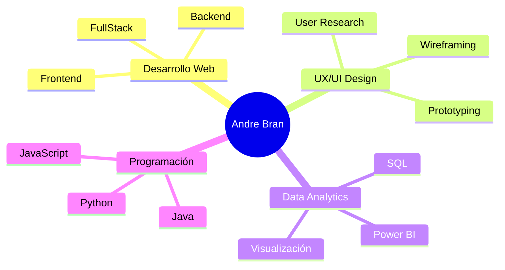

<div align="center">
  

## ⚡ Transformando Ideas en Código ⚡

  <p align="center">
    
  </p>
</div>

<br>

<div align="center">
  
</div>

-----

## 🌊 Sobre Mi Trayectoria

<table>
<tr>
<td width="50%">

```yaml
persona:
  nombre: "Andre Bran"
  rol: "Desarrollador FullStack"
  educación: "4° año Ing. Sistemas"
  especialidad: "Ciencias de la Computación"
  
filosofía:
  mindset: "Innovación constante"
  enfoque: "Usuario primero"
  objetivo: "Soluciones que impactan"
  
stack_actual:
  frontend: ["HTML5", "CSS3", "JavaScript", "Three.js"]
  backend: ["Java", "PHP", "Python"]
  design: ["Figma", "Adobe XD", "UX/UI"]
  data: ["SQL", "Power BI", "Pandas", "NumPy"]
```

</td>
<td width="50%">

### 🎯 Mi Enfoque

🔹 **Diseño Centrado en el Usuario**  
Creo experiencias digitales intuitivas y memorables

🔹 **Código Limpio y Eficiente**  
Desarrollo con las mejores prácticas

🔹 **Innovación Constante**  
Siempre explorando nuevas tecnologías

🔹 **Análisis de Datos**  
Transformando información en decisiones

</td>
</tr>
</table>

-----

## 💠 Ecosistema Tecnológico

<div align="center">

### 🎨 Frontend & Diseño


### 💻 Backend & Lógica


### 📊 Data & Analytics


### 🛠️ DevTools


</div>

-----

## 🔷 Proceso Creativo

<div align="center">
  
</div>

<table>
<tr>
<td width="25%" align="center">


**IDEAR**

Conceptualización y brainstorming de soluciones innovadoras

</td>
<td width="25%" align="center">


**DISEÑAR**

Creación de interfaces intuitivas y atractivas visualmente

</td>
<td width="25%" align="center">


**DESARROLLAR**

Codificación con las mejores prácticas y arquitecturas

</td>
<td width="25%" align="center">


**LANZAR**

Implementación y mejora continua del producto

</td>
</tr>
</table>

-----

## 🌐 Áreas de Expertise

<div align="center">


```mermaid
mindmap
  root((Andre Bran))
    Desarrollo Web
      Frontend
      Backend
      FullStack
    UX/UI Design
      Wireframing
      Prototyping
      User Research
    Data Analytics
      SQL
      Power BI
      Visualización
    Programación
      Java
      Python
      JavaScript
```

</div>

-----

## 🎯 En Constante Evolución

<div align="center">

|🎓 Aprendiendo Ahora|🚀 Próximos Objetivos    |💡 Intereses Futuros    |
|:-----------------:|:----------------------:|:---------------------:|
|SQL Avanzado       |Machine Learning        |Cloud Computing        |
|Power BI           |Arquitectura de Software|Inteligencia Artificial|
|Data Science       |DevOps & CI/CD          |Blockchain             |

</div>

-----

## 💎 Filosofía de Desarrollo

<div align="center">


> ### “El mejor código es aquel que no solo funciona, sino que inspira”


</div>

<table>
<tr>
<td align="center" width="33%">

🔷 **Simplicidad**  
Código limpio y mantenible

</td>
<td align="center" width="33%">

🔷 **Innovación**  
Siempre buscando nuevas soluciones

</td>
<td align="center" width="33%">

🔷 **Impacto**  
Crear valor real para los usuarios

</td>
</tr>
</table>

-----

## 🤝 Conectemos y Colaboremos

<div align="center">

  

### 💼 Abierto a Proyectos Innovadores y Colaboraciones

[](https://github.com/TU_USUARIO)
[](https://linkedin.com/in/TU_USUARIO)
[](mailto:tu_email@example.com)
[](https://tu-portfolio.com)

  <br>

  

</div>

-----

<div align="center">

### ⚡ “Crea, Diseña, Innova” ⚡


</div>

